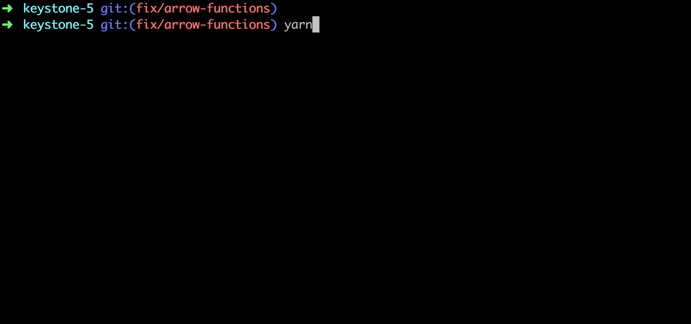

## Contribution Guidelines

## Publishing

When publishing keystone, we are using `@atlaskit/build-releases` in combination with `bolt` to publish individual packages.

### What all contributors need to do

- Make your changes (as per usual)
- Before you make a Pull Request, run the `bolt changeset` (or `yarn changeset`) command. Answer the questions that are asked. It will want to know:
  - what packages you want to publish
  - what version you are releasing them at
  - a message to summarise the changes (this message will be written to the changelog of bumped packages)
- Before you accept the changeset, it will inform you of any other dependent packages within the repo that will also be bumped by this changeset. If this looks fine, agree, and a changeset commit will be generated.



Here is what a changeset commit looks like:

```
CHANGESET: converts functions to arrow functions for some reason

Summary: converts functions to arrow functions for some reason

Release notes: <none>

Releases: @voussoir/core@patch

Dependents: []

---
{"summary":"converts functions to arrow functions for some reason","releases":[{"name":"@voussoir/core","type":"patch"}],"dependents":[]}
---
```

This generated changeset stores information about a desired version bump in a commit message.

An example, if you generate a changeset that includes `adapter-mongoose` as a patch, and `core` as a minor, you can merge your PR, and the next time the `version-packages` command is run, these will both be updated.

You can have multiple changesets in a single PR. This will give you more granular changelogs, and is encouraged.

> IMPORTANT INFORMATION
> By default, changesets generate empty git commits, unless you had any staged changes.
> If you have empty commits, a rebase removes them by default, so changesets that are empty will be lost.

### How to do a release

> This should only ever be done by a very short list of core contributors

Releasing is a two-step process. The first step updates the packages, and the second step publishes updated packages to npm.

#### Steps to version packages


The first step is `bolt version-packages`. This will find all changesets that have been created since the last release, and update the version in package.json as specified in those changesets, flattening out multiple bumps to a single package into a single version update.

The `bolt version-packages` command will generate a release commit, which will bump all versions, necessary dependency version changes, and update changelog.mds.

To demonstrate, imagine you have the following two changesets:

```
...
Summary: Fixed a bug that caused relationships to be added twice

Releases: @voussoir/core@minor, @voussoir/adapter-mongoose@patch
...
```

and the second changest:

```
...
Summary: Converted functions to arrow functions for some reason

Releases: @voussoir/core@patch
...
```

with `core` currently at `0.1.1`, and `adapter-mongoose` at `0.1.3`.

The `version-packages` command will make a commit with the following changes:

- The version in `core`'s `package.json` will be updated to `0.2.0`
- The version in `adapter-mongoose`'s `package.json` will be updated to `0.1.4`
- The `CHANGELOG.md` of core will be updated to have the following at the top of the file:

```
## 0.2.0
- [minor] Fixed a bug that caused relationships to be added twice [GIT_HASH](https://github.com/our_repo/commits/GIT_HASH)
- [patch] Converted functions to arrow functions for some reason [GIT_HASH](https://github.com/our_repo/commits/GIT_HASH)
```

- The `CHANGELOG.md` of adapter-mongoose will be updated to have the following at the top of the file:

```
## 0.1.4
- [patch] Fixed a bug that caused relationships to be added twice [GIT_HASH](https://github.com/our_repo/commits/GIT_HASH)
```

The commands to run are:

```sh
git checkout master
git pull
git checkout -D temp-release-branch
git checkout -b temp-release-branch
bolt version-packages
git push -f
```

Once you have run this you will need to make a pull request to merge this back into master.

#### Release Process

Once the version changes are merged back in to master, to do a manual release:

```sh
git checkout master
git pull
bolt publish-changed
git push --tags
```

The `bolt publish-changed` command finds packages where the version listed in the `package.json` is ahead of the version published on npm, and attempts to publish just those packages.

Because of this, we should keep the following in mind:
- Once the `publish-changed` command has been run, the PR from the `temp-release-branch` should be merged before any other PRs are merged into master, to ensure that no changesets are skipped from being included in a release.
- There is no reason you should ever manually edit the version in the `package.json`

### A quick note on changelogs

The release process will automatically generate and update a `CHANGELOG.md` file, however this does not need to be the only way this file is modified. The changelogs are deliberately static assets so past changelogs can be updated or expanded upon.

In addition, content added above the last released version will automatically be appended to the next release. If your changes do not fit comfortably within the summary of a changelog, we encourage you to add a more detailed account directly into the `CHANGELOG.md`.

TODO: Add example of what this means
